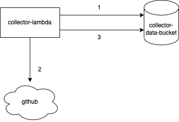

# collector-lambda

A tool to collect issues and prs.

## 采集

采集的流程为定时任务。
采集数据存储在 aws s3 中，通过 athena 操作数据，使用`org.apache.hive.hcatalog.data.JsonSerDe`作为数据格式。



一次采集：
1. collector 通过 athena 查询 s3 中的最新时间，时间作为查询数据的参数，用于增量更新
2. collector 通过 github sdk 拉取 issues 数据和 pull requests
3. collector 通过 athena 将增量数据上传存储
4. athena 控制台可查询保存报表

## TODO

1. 前端展示可通过 quicksight 作为展示，quicksight => athena => s3

## 部署

### athena table

```
CREATE EXTERNAL TABLE IF NOT EXISTS records (
  ID BIGINT,
  Number INT,
  Type INT,
  UserID BIGINT,
  UserType INT,
  UserLogin STRING,
  CreatedAt TIMESTAMP
  )
  ROW FORMAT SERDE 'org.apache.hive.hcatalog.data.JsonSerDe'
  WITH SERDEPROPERTIES ( 'serialization.format' = '1' )
  LOCATION 's3://collector-data-bucket/';
```

### docker build
```
export VERSION=0.0.1
docker build -t collector-lambda:$VERSION -f ./cmd/Dockerfile .
```


### aws deploy
```
https://docs.aws.amazon.com/zh_cn/lambda/latest/dg/golang-package.html
```
